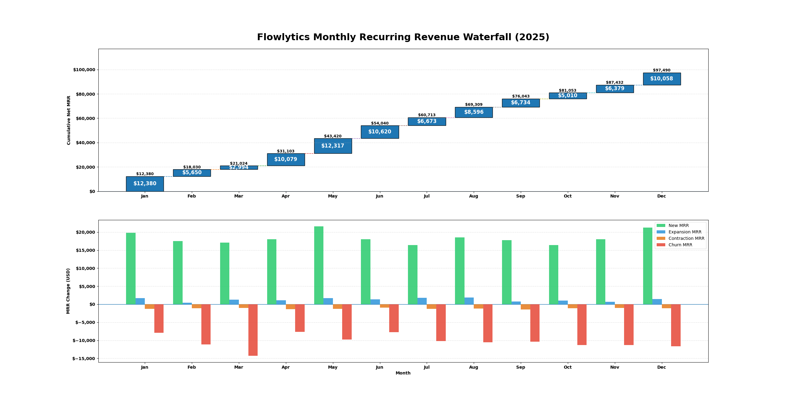
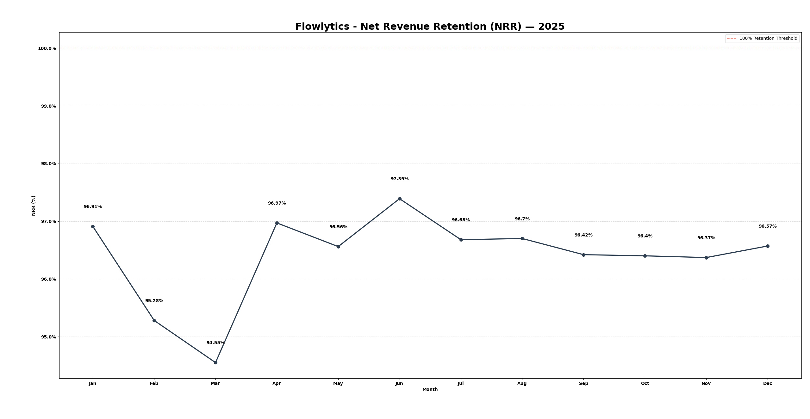
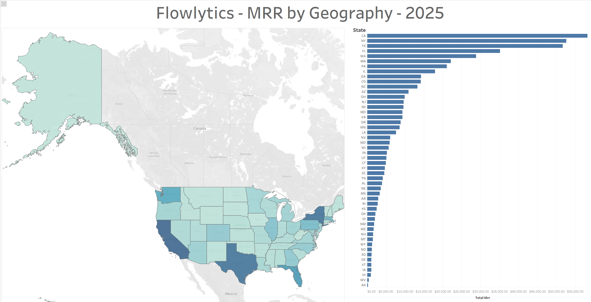
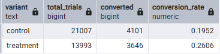
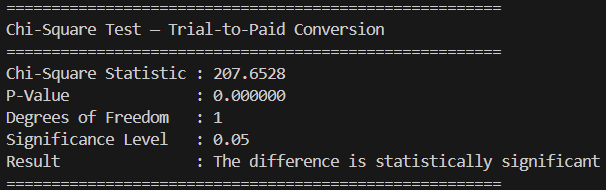
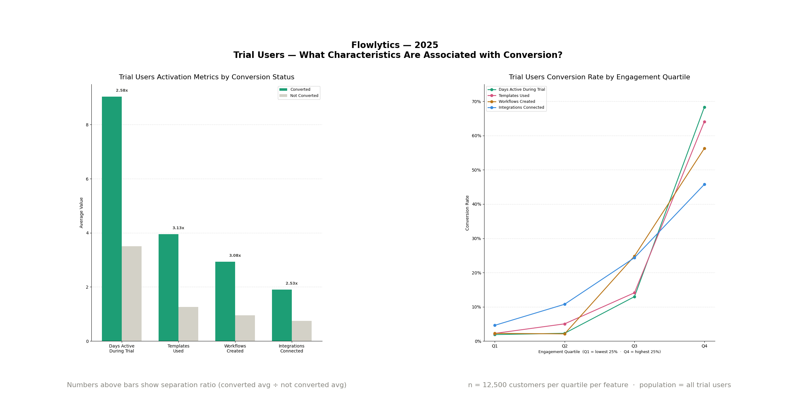
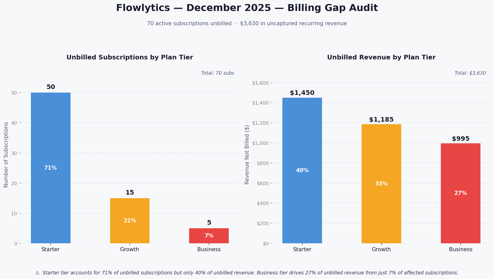

WIP - Work in Progress - March 21 2026

# SaaS Flowlytics - Subscription Revenue - Product Analytics - Revenue Reconciliation Analytics
MRR Movement, Net Revenue Retention, Geographic Revenue Distribution, Onboarding Experiment Analysis, and Revenue & Billing Reconciliation

 

This project analyzes three years of synthetic SaaS subscription data from a simulated workflow automation platform, spanning January 2024 to June 2026. The dataset contains customer-level, trial-level, subscription lifecycle, billing, and engagement records, along with product experiment assignments and marketing acquisition data.

The analysis evaluates subscription revenue dynamics, customer activation behavior, product experimentation outcomes, and financial reconciliation across the subscription and billing systems. The full workflow is built end-to-end using SQL and Python across a dataset representing the entire SaaS customer lifecycle—from trial signup and onboarding to subscription activation, expansion, contraction, churn, billing, and payment events.

 

➤ Project Goal / Purpose: 

This project evaluates how a simulated SaaS subscription business generates and retains recurring revenue over time—examining whether subscription growth is stable, whether product onboarding improvements meaningfully increase activation, and whether billing operations accurately capture all expected revenue.

The analysis measures monthly recurring revenue (MRR) movement by identifying new subscriptions, expansion upgrades, contraction downgrades, and churn events. It evaluates Net Revenue Retention (NRR) trends to determine whether existing customers expand their subscription value over time or whether revenue growth relies primarily on new customer acquisition.

At the product level, the project evaluates a controlled onboarding experiment to determine whether a redesigned onboarding experience increases trial-to-paid conversion. The analysis compares conversion rates between control and treatment groups, tests statistical significance, and analyzes user engagement characteristics associated with successful activation.

At the financial operations level, the project performs revenue reconciliation between subscription records and billing invoices to identify operational discrepancies such as missing invoices, billing errors, or delayed billing events. The objective is to evaluate whether subscription activity and billing operations remain aligned, ensuring that expected recurring revenue is properly captured.

 

➤ Skills Demonstrated: 

Subscription revenue modeling (MRR movement and Net Revenue Retention), geographic revenue analysis, product experiment evaluation (A/B testing and statistical significance testing), trial-to-paid conversion analysis, behavioral feature analysis, and financial reconciliation between subscription and billing systems.

(SQL • Python • Pandas • SaaS Revenue Analytics • A/B Experiment Analysis • Revenue Reconciliation • Executive-Ready Analysis)

 

➤ Core Business Questions : 

**1. REVENUE & SUBSCRIPTION ECONOMICS**
   
  1. How does Monthly Recurring Revenue (MRR) change each month when broken into new, expansion, contraction, and churned MRR?
  2. How does Net Revenue Retention (NRR) change over time?
  3. How are customers and subscription revenue distributed across U.S. states?
   
**2. PRODUCT EXPERIMENTATION**
   
  1. Does the new onboarding experience increase trial-to-paid conversion?
  2. Is the difference in trial-to-paid conversion between the control and treatment groups statistically significant?
  3. What user characteristics are associated with trial-to-paid conversion?

**3. FINANCIAL DATA VALIDATION — DECEMBER 2025 BILLING AUDIT**

  1. Which active subscriptions did not generate a billing invoice in December 2025, and how much recurring revenue was not billed?
  2. Which December 2025 billing invoices were generated for subscriptions that were not active that month, and how much was overbilled?
  3. Which December 2025 billing invoices have not been fully paid or were paid outside the expected payment window, and how much billed revenue remains uncollected?

 

➤ Executive Summary : 
Work in Progress

 

➤ The Dataset : 
The raw dataset spans January 2024 through June 2026, and all reporting and conclusions in this project are intentionally scoped to this full analytical window to evaluate subscription revenue growth, customer activation behavior, product experimentation outcomes, and financial reconciliation across the subscription lifecycle.

The analysis uses nine core tables representing a simulated SaaS workflow automation platform (“Flowlytics”):

**customers**
- Used to define customer cohorts, analyze geographic revenue distribution, and segment customers when evaluating subscription revenue patterns and experiment outcomes.
- One row per customer.
- Contains **signup_date**, **acquisition** channel, and geographic attributes (**state**, **region**).

**trials**
- One row per trial signup.
- Used to analyze the trial funnel, measure trial-to-paid conversion behavior, and define the population exposed to onboarding experiments.
- Contains **trial_start**, **trial_end**, and the associated **customer_id**.

**trial_engagement_summary**
- Used to analyze which product usage patterns are associated with successful trial-to-paid conversion.
- One row per trial user summarizing engagement behavior during the trial period.
- Contains engagement metrics such as **templates_used**, **workflows_created**, **days_active_during_trial**, and **integrations_connected**.

**experiment_assignments**
- Used to evaluate whether the redesigned onboarding experience increases trial-to-paid conversion and to test statistical significance between experiment groups.
- One row per customer assigned to the onboarding experiment.
- Contains the experiment variant (**control** vs **treatment**).

**subscriptions**
- Used to track the subscription lifecycle and define which customers are expected to generate recurring revenue.
- One row per subscription lifecycle record.
- Contains **subscription_start**, **plan_tier**, and the current **subscription_status** (**active**, **cancelled**, or **trial_only**).

**subscription_events**
- Used to construct Monthly Recurring Revenue (MRR) movement and analyze revenue growth through new subscriptions, upgrades, downgrades, and churn.
- One row per subscription revenue event.
- Contains **event_date**, **event_type** (**new**, **expansion**, **contraction**, **churn**), and the associated **mrr_change**.

**billing_invoices**
- Used to represent the billing system and support reconciliation between expected subscription revenue and invoiced revenue.
- One row per billing invoice generated for an active subscription.
- Contains **invoice_month**, **invoice_amount**, and the associated **subscription_id** and **customer_id**.

**payments**
- Used to measure cash collection behavior, identify unpaid or late invoices, and reconcile billed revenue against collected payments.
- One row per payment transaction applied to an invoice.
- Contains **payment_date**, **payment_amount**, **payment_status**, and **days_to_pay**.

**acquisition_costs**
- Used to analyze customer acquisition patterns and support marketing cost analysis across the subscription lifecycle.
- One row per month per acquisition channel.
- Contains marketing spend across **channels** such as **Google Ads**, **LinkedIn**, **Partner**, and **Organic**.

 

---

 >

## The Main Report - Key Questions Answered

### 1 — REVENUE & SUBSCRIPTION ECONOMICS
Are our existing customers bringing in more revenue over time, or do we need a constant flow of new customers just to keep the numbers up?

 

**1-1  How does Monthly Recurring Revenue (MRR) change each month when broken into new, expansion, contraction, and churned MRR?**

**Tables used**
- subscription_events

**SQL Method**
- **Filter subscription_events to the analytical window:** Keep only rows where event_date falls within January 2024 to June 2026. Retain subscription_id, event_date, event_type, and mrr_change.
  - Truncate **event_date** to the first day of the month and name it **mrr_month**.
- **Aggregate by month and event type:** Group by mrr_month and event_type.
  - Sum **mrr_change** to produce **total_mrr** — the total MRR contributed by each event type in that month.
- **Pivot event types into columns:** Group by mr**r**_month and conditionally sum **total_mrr** for each event type into separate columns — **new_mrr**, **expansion_mrr**, **contraction_mrr**, and **churn_mrr**.
  - Sum all four columns to produce **total_mrr** — the net MRR change for that month.

**Python Method**
- No data modeling is done on python, python is just used to visualize the data.

 

**Charts**

  

 

**Key Insights**

- **MRR grew every single month in 2025 without exception.** The business ended the year at $97,490 in cumulative net MRR, adding positive net MRR all 12 months.
- **New customer acquisition is the sole growth engine.** New MRR runs at $16,000–$21,000 every month and completely dominates the chart. Expansion from existing customers is minimal — barely visible against the green bars.
- **Q1 was the most volatile quarter.** March shows the deepest churn of the year at over -$14,000, which nearly wiped out all new MRR that month — net MRR of only $2,994. This directly explains the NRR dip to 94.55% in March.
- **Churn is the biggest threat to the business.** Running at -$7,000 to -$14,000 every month, churn consistently offsets a large portion of new revenue. The business is essentially running on a treadmill — acquiring new customers to replace the ones leaving.
- **Expansion is too small to matter.** Expansion MRR never exceeds $2,000 in any single month. This means the business has not found a way to grow revenue from customers already on the platform — upselling and cross-selling are not working.

 

---

 

**1-2  How does Net Revenue Retention (NRR) change over time?**

First, generate monthly MRR table across time.

**Tables used**
- subscription_events

**SQL Method**
- **Filter subscription_events to the full historical range:** Keep only rows where event_date falls between January 2023 and December 2025. Retain **subscription_id**, **event_date**, **event_type**, and **mrr_change**.
  - Truncate event_date to the first day of the month and name it mrr_month.
- **Aggregate MRR components by month:** Group by **mrr_month** and conditionally sum **mrr_change** for each event type into **new_mrr**, **expansion_mrr**, **contraction_mrr**, and **churn_mrr**.
  - Sum all four components to produce **total_mrr** — the net MRR change for that month.
- **Calculate cumulative MRR balance:** From the aggregated table, compute **mrr_balance** as the running cumulative sum of **total_mrr** ordered by **mrr_month** — representing the total MRR the business has built up through the end of each month.

That generates "**01_2a_MRR_Across_Time.csv**"

Next we generate the NRR calculations.

**SQL Method**
- **Filter MRR table ( 01_2a_MRR_Across_Time )  without a date filter:** Retain **mrr_month**, **expansion_mrr**, **contraction_mrr**, and **churn_mrr**.
  - For each month, look back one month and pull **mrr_balance** from the prior month — name it **starting_mrr**. This is the existing revenue base going into the current month.
- **Calculate NRR per month:** Keep only rows where **mrr_month** falls within 2025. Compute **nrr_pct** as (**starting_mrr** + **expansion_mrr** + **contraction_mrr** + **churn_mrr**) / **starting_mrr** × 100.

**Python Method**
- No data modeling is done on python, python is just used to visualize the data.

 

**Charts**

  

**Key Insights**

- **Flowlytics grew every month in 2025, but entirely from new customers signing up.** Existing customers were not spending more over time — upgrades and expansions were minimal all year.
- **Existing customers were leaving or downgrading every single month.** The business lost between 2.6% and 5.5% of its existing revenue each month to cancellations and downgrades. New signups covered the losses, but just barely.
- **March was the worst month.** Churn spiked, new revenue barely covered the losses, and the business nearly flatlined. After March things improved, but the underlying problem never went away.
- **The business is entirely dependent on new customer acquisition.** Every month, Flowlytics has to sign up enough new customers just to replace the ones it lost. If new signups slow down for even one or two months, revenue will drop. That is a fragile position to be in.
- **The opportunity is in existing customers.** If Flowlytics could get them to upgrade their plans or use more features, revenue would grow even without a single new signup. Right now that is not happening.

 

---

 

**1-3  How are customers and subscription revenue distributed across U.S. states?**

**Tables used**:
- subscriptions
- subscription_events
- customers

**SQL Method**
- **Filter subscriptions to active records only:** Reduce the subscriptions table to rows where **subscription_status** = '**active**'. Keep **subscription_id** and **customer_id**.
- **Filter subscription events up to December 31 2025:** Reduce the **subscription_events** table to rows where **event_date** is on or before December 31, 2025. This captures the full event history needed to reconstruct each customer's MRR standing as of December 31 2025. Keep **subscription_id** and **mrr_change**.
- **Join active subscriptions to their events:** Join the filtered subscriptions to the filtered events on **subscription_id**. Keep **customer_id** and **mrr_change**.
- **Aggregate net MRR per customer:** Group by **customer_id** and sum **mrr_change** to produce **net_mrr** — the MRR standing for each active customer as of December 31 2025.
- **Join customer MRR to customers to bring in state:** Join the aggregated customer MRR result to the customers table on **customer_id**. Keep **customer_id**, **state**, and **net_mrr**.
- **Aggregate metrics by state:** Group by state and produce:
  - **customer_count** — number of active customers in that state as of December 31 2025
  - **total_mrr** — sum of **net_mrr** across all active customers in that state

**Python Method**
- No data modeling is done on python : visualization is done in Tableau Public

 

**Charts**

  

**Key Insights**
- **Revenue is heavily concentrated in three states**. CA, NY, and TX are the clear leaders — visually the darkest on the map and the longest bars on the chart. There is a noticeable gap between TX and FL, marking a sharp drop-off after the top three.
- **The top 5 states follow U.S. tech and population centers**.CA, NY, TX, FL, and WA dominate the bar chart. This is expected for a workflow automation product — these states have the highest density of tech companies and knowledge workers.
- **The revenue base is top-heavy.** After the top 5 states the bars shrink rapidly and consistently. The majority of states show minimal bar length, indicating that most of the U.S. geography contributes very little to total MRR.

**1-4  Business Recommendation**
- **Flowlytics has a stable and growing revenue base, but the growth model is fragile.** The business is entirely dependent on new customer acquisition to offset churn. If new signups slow down for even one or two months, total MRR will decline. This is not a sustainable position for a mature SaaS company.
- There are two levers available to fix this.
  - **The first is reducing churn.** Churn runs at $7,000 to $14,000 every month — that is revenue the business has already earned and is losing. Identifying why customers cancel and addressing those reasons directly will have immediate impact on net MRR without requiring a single new signup.
  - **The second is expanding revenue from existing customers**. Expansion MRR never exceeds $2,000 in any month — meaning upselling and plan upgrades are effectively not happening. A mature SaaS business should be growing revenue from its existing base through plan upgrades, seat expansion, or add-on features. Flowlytics is not doing this. Fixing this would allow the business to grow even in months where new customer acquisition is slow.
- **Geographic concentration is a secondary risk.** CA, NY, and TX together represent a disproportionate share of total MRR. A significant economic disruption or competitive entry in any of these three states would have outsized impact on the business.

 

---

 

### 2 — PRODUCT EXPERIMENTATION

**2-1  Does the new onboarding experience increase trial-to-paid conversion?**

**Tables used :**
- trials.csv
- experiment_assignments.csv
- subscriptions.csv

**SQL Method**
- **Join trials to experiment assignments:** Join the trials table to the **experiment_assignments** table on **customer_id**. Keep **customer_id** and variant. This produces the experiment population — trial customers who were assigned to a variant.
- **Filter the subscriptions table to conversion status:** From the subscriptions table, keep **customer_id** and **subscription_status** across all status values.
  - **Create a derived column called converted**: set it to 1 if **subscription_status** is active or cancelled, otherwise 0. A customer who ever activated a paid subscription is considered converted regardless of whether they later cancelled.
- **Join trials to experiment assignments:** Join the filtered trials table to the filtered experiment assignments table on **customer_id**. This produces the experiment population — trial customers who were assigned to a variant.
- **Join the experiment population to conversion status:** Left join the experiment population to the filtered subscriptions table on **customer_id**. Use a left join to retain trial customers who have no subscription record. Set converted to 0 for customers with no match.
- **Aggregate conversion metrics by variant:** Group by variant. Calculate **total_trials** as the count of customers, converted as the sum of the converted flag, and **conversion_rate** as converted divided by **total_trials**.

**Python Method**
- No data modeling is done on python, there is no visualization necessary to answer this business question.

 

**Charts**

  

**Key Insights :**

- The treatment group converted at 26.06%, compared to 19.52% for the control group — a difference of 6.54 percentage points.
- The new onboarding experience produced a 33.5% relative improvement in trial-to-paid conversion over the old experience.
- The treatment group had fewer trial users (13,993) than the control group (21,007) — a 60/40 split rather than the expected 50/50. This unequal distribution is worth investigating as it may indicate an issue with the experiment assignment process.
- The data directionally supports that the new onboarding experience is more effective at converting trial users to paid subscribers. However, statistical significance has not yet been tested — that is business question 2-2.

 

---

 

**2-2  Is the difference in trial-to-paid conversion between the control and treatment groups statistically significant?**

**Tables used :**
02_1_Trial_To_Paid_Conversion.csv

**Python Method**
- **Extract conversion counts from the dataframe:** From the loaded dataframe, pull **total_trials** and **converted** for each variant. Derive **not_converted** as **total_trials** minus **converted**. These two values — **converted** and **not_converted** — form the contingency table for the chi-square test.
- **Build the contingency table:** Construct a 2x2 contingency table with one row per variant and two columns — **converted** and **not_converted**. This is the input format required by the chi-square test.
- **Run the chi-square test:** Apply a chi-square test of independence on the contingency table. Extract the chi-square statistic, p-value, and degrees of freedom from the result.
- **Evaluate statistical significance:** Compare the p-value against a significance threshold of 0.05. If the p-value is below 0.05, the difference in conversion rates is statistically significant. If it is at or above 0.05, the difference is not statistically significant.
- **Print the results:** Output the chi-square statistic, p-value, degrees of freedom, and the significance conclusion in plain English.

 

**Charts**

  

**Key Insights :**
- The chi-square statistic is 207.65, which is very large. This means the observed conversion counts are far from what would be expected if the new onboarding had no effect.
- The p-value is 0.000000 — effectively zero. This means the probability of seeing a difference this large by random chance alone is virtually zero.
- The result is statistically significant at the 0.05 significance level. The 6.54 percentage point improvement in conversion rate from the new onboarding experience is a real effect, not random noise.
- Combined with the findings from 2-1, the evidence is clear: the new onboarding experience meaningfully increases trial-to-paid conversion and the result is statistically confirmed.

 

---

 

**2-3  What user characteristics are associated with trial-to-paid conversion?**

**Tables used :**
- trials 
- trial_engagement_summary
- subscriptions 

**SQL Method - Trial Users Activation Metrics by Conversion Status**
- **Pull all trial customers as the base population:** Filter the **trials** table to keep only **customer_id**. Each row represents one unique trial participant.
- **Bring in engagement features:** Left join the trial population to **trial_engagement_summary** on **customer_id**. Keep **templates_used**, **workflows_created**, **days_active_during_trial**, and **integrations_connected**.
- **Bring in subscription status:** Left join the result to subscriptions on **customer_id**. Keep **subscription_status**. Use a left join so trial customers with no subscription record are retained.
- **Create the conversion flag:** Derive a new column from **subscription_status**, name it **converted**. Set it to 1 if **subscription_status** is **active** or **cancelled**, otherwise set it to 0.
- **Compute average engagement by conversion status:** Group by **converted**. For each group compute:
  - **customer_count**              — total number of customers in each group
  - **avg_templates_used**          — average templates used
  - **avg_workflows_created**       — average workflows created
  - **avg_days_active**             — average days active during trial
  - **avg_integrations_connected**  — average integrations connected
- **Pivot the averages into one row per feature:** Reshape the two-row result so each feature becomes its own row. Each row contains the feature name, the average for converted users, and the average for non-converted users.
- **Compute the separation ratio:** For each feature, divide the converted average by the non-converted average. This produces a single number per feature that represents how much higher engagement is for converters relative to non-converters. A higher ratio means a stronger predictor.

**SQL Method - Trial Users Conversion Rate by Engagement Quartile**
- **Pull all trial customers as the base population:** Filter the trials table to keep only **customer_id**. Each row represents one unique trial participant.
- **Bring in engagement features:** Left join the trial population to **trial_engagement_summary** on **customer_id**. Keep **templates_used**, **workflows_created**, **days_active_during_trial**, and **integrations_connected**.
- **Bring in subscription status:** Left join the result to **subscriptions** on **customer_id**. Keep **subscription_status**. Use a left join so trial customers with no subscription record are retained.
- **Create the conversion flag:** Derive a new column converted. Set it to 1 if **subscription_status** is **active** or **cancelled**, otherwise set it to **0**.
- **Assign quartile buckets for each engagement feature:** Using the converted dataset, assign each customer to a quartile (1–4) for each of the four features independently. Q1 is the lowest 25% engagement, Q4 is the highest 25% engagement.
- **Compute conversion rate per feature per quartile** — templates used: Group by templates_quartile. Compute:
  - **feature** — label as templates_used
  - **total_customers** — number of customers in that quartile
  - **converted_customers** — number who converted
  - **conversion_rate** — converted customers divided by total customers
- **Compute conversion rate per feature per quartile — workflows created:** Same structure as above, group by **workflows_quartile**, label feature as **workflows_created**.
- **Compute conversion rate per feature per quartile — days active during trial:** Same structure, group by **days_active_quartile**, label feature as **days_active_during_trial**.
- **Compute conversion rate per feature per quartile — integrations connected:** Same structure, group by **integrations_quartile**, label feature as **integrations_connected**.
- **Stack all four feature outputs into one result:** Union all four aggregation CTEs into a single output. Order by feature and quartile ascending.

  

**Key Insights**
Based on the two charts:

- Conversion only happens at the top engagement tier/ at Quartile 4. This means low-to-mid engagement during trial is not a reliable signal — users need to be in the top 25% of engagement before conversion becomes likely.
- "Templates used" and "workflows" created are the strongest differentiators. Both show separation ratios above 3x. Converted users used 3x more templates and created 3x more workflows than non-converters. These two features best separate the two groups.
- Days active has the sharpest Q4 jump. At Q4, days active reaches 68% conversion rate — the highest of all four features. Users who consistently return during the trial are the most likely to pay. Stickiness is the strongest conversion signal.
- Integrations connected is the most linear predictor. Unlike the other three features which are flat until Q4, integrations connected shows a steadier climb from Q1 to Q4. Every additional integration meaningfully increases conversion probability even at lower engagement levels. This makes it the most actionable early signal — a user who connects even one integration is already more likely to convert than someone who uses templates or creates workflows at the same engagement tier.

 

**2-4 Business Recommendation :**
- **Roll out the new onboarding experience to all trial users.** The treatment group converted at 26% vs 19.5% for control — a 6.54 percentage point improvement that is statistically confirmed. There is no reason to keep the old experience running.
- **Build onboarding flows that push users toward templates and workflows early.** Templates used and workflows created are the strongest predictors of conversion at 3.13x and 3.08x separation. The onboarding experience should guide every new trial user to use at least one template and create at least one workflow within the first few days.
- **Use integration connection as the early warning signal.** Integrations connected is the most linear predictor — even one integration meaningfully increases conversion probability. Flag trial users who have not connected any integration by day 3 and trigger a re-engagement nudge.
- **Focus re-engagement efforts on users who are not returning.** Days active at Q4 has the highest conversion rate at 68%. Users who stop logging in after day 1 or 2 are very unlikely to convert. An automated email or in-app prompt targeting inactive trial users could recover a meaningful portion of that group.

 

---

 

### 3 — FINANCIAL DATA VALIDATION — DECEMBER 2025 BILLING AUDIT

**3-1 Which active subscriptions did not generate a billing invoice in December 2025, and how much recurring revenue was not billed?**

**Tables used :**
- subscriptions
- billing_invoices
- customers

**SQL Method - Which Active Subscriptions Are Not Billed ?**
- **Filter subscriptions to active records only:** Filter the subscriptions table to keep only rows where subscription_status = '**active**'. Retain **subscription_id**, **customer_id**, and **plan_tier**.
- **Filter billing invoices to December 2025:** Filter the **billing_invoices** table to keep only rows where **invoice_month** falls within December 2025. Retain **subscription_id** only.
- **Identify active subscriptions with no December 2025 invoice:** Left join the filtered subscriptions onto the filtered billing invoices using **subscription_id** as the join key. Retain only rows where no matching invoice exists. Retain **subscription_id**, **customer_id**, and **plan_tier**.
- **Assign expected invoice amount per subscription:** From the gap records, derive a new column called **expected_amount** using **plan_tier** as the business rule — set to 2**Starter** = 29, **Growth** = 79, and **Business** = 199. Retain **subscription_id**, **customer_id**, **plan_tier**, and **expected_amount**.

The answer of this business question is here :
[03_1a_Which_Active_Subs_Not_Billed.csv](https://raw.githubusercontent.com/felixsuwarno/SaaS_Flowlytics-Subscription_Revenue-Product_Analytics-Revenue_Reconciliation_Analytics/refs/heads/main/Data_Generated/03_1a_Which_Active_Subs_Not_Billed.csv)
-> this contains 70 subscriptions_id which are not billed properly in December 2025.

**SQL Method - How Much was the Missing Bill**
- **Load the billing gap records:** Read from **03_1a_Which_Active_Subs_Not_Billed** which contains all active subscriptions with no December 2025 invoice and their expected_amount. Retain **plan_tier** and **expected_amount**.
- **Aggregate revenue leakage by plan tier:** Group by **plan_tier** and calculate two metrics:
  - **subscription_count:** the number of active subscriptions with no December 2025 invoice in that tier
  - **revenue_not_billed:** the sum of expected_amount across all gap subscriptions in that tier

**Python Method**
Python is used to visualize the data, there is no data modeling steps needed.

  

**Key Insights**
Based on the two charts:
- **The problem is concentrated in Starter by volume but not by value.** 50 of the 70 unbilled subscriptions (71%) are Starter tier. But Starter only accounts for $1,450 of the $3,630 gap (40%). The gap is wide but cheap per subscription — each Starter miss is only $29.
- **Business tier is the priority to fix first.** Only 5 subscriptions missed billing, but each one is $199. That's $995 in missed revenue from just 7% of the affected subscriptions. Highest revenue impact per case.
- **Growth tier is the middle problem — moderate volume, moderate value.** 15 subscriptions, $1,185 missed. At $79 each it sits between the other two. Not urgent per case but meaningful in aggregate — it's actually the second largest revenue gap at 33%.
- **The operational takeaway:** If you're triaging this audit, fix Business first (high value, few records), then Growth, then Starter. Volume alone is a misleading priority signal here.

 

---

 

**3-2 Which December 2025 billing invoices were generated for subscriptions that were not active that month, and how much was overbilled?**

**Tables used :**
- subscriptions
- billing_invoices
- subscription_events

**SQL Method - Which inactive subscriptions are billed?**

- **Filter billing_invoices table to keep only December 2025 invoices:** Reduce the billing table to the invoice records needed for this audit.
  - Keep `**invoice_id**`, `**subscription_id**`, `**customer_id**`, `**invoice_month**`, and `**invoice_amount**`.
  - Retain only rows where `**invoice_month**` is December 2025.
- **Filter subscription_events table to keep churn events that determine whether a subscription stopped being active before December 2025:** Reduce the event table to the cancellation timing needed for the activity test.
  - Keep `**subscription_id**`, `**event_date**`, and `**event_type**`, and retain only rows where `**event_type** = '**churn**'`.
- **Create a subscription-level December 2025 activity flag using churn timing:** Label each subscription as active in December 2025 or not active in December 2025 based on whether it churned before the month began.
  - Group by **subscription_id**.
  - Create **first_churn_date**, which is the earliest churn date for the subscription, by taking the minimum value of **event_date** from the **subscription_events** table where **event_type** = '**churn**'
  - Create `**active_in_dec_2025**` and set it to 0 when `**first_churn_date**` is before December 1, 2025; otherwise set it to 1.
- **Join December 2025 invoices to the subscription activity table and keep only invoices billed to subscriptions that were not active that month:** Identify the invoice records that were generated for subscriptions already churned before December 2025.
  - Join the December 2025 invoices table to the subscription activity table using `**subscription_id**`.
  - Bring together **invoice_id**, **subscription_id**, **customer_id**, **invoice_amount** , and **active_in_dec_2025**, and retain only rows where **active_in_dec_2025** = 0`.

