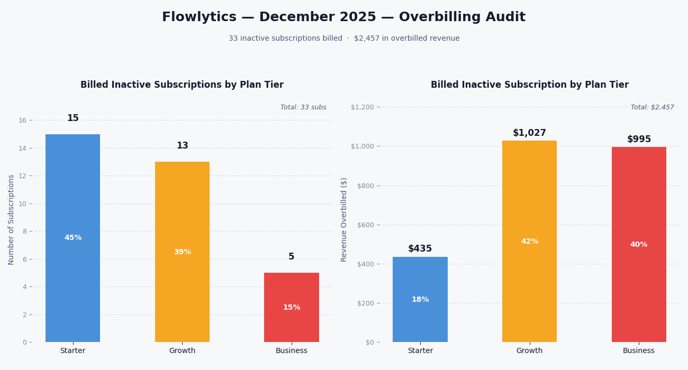
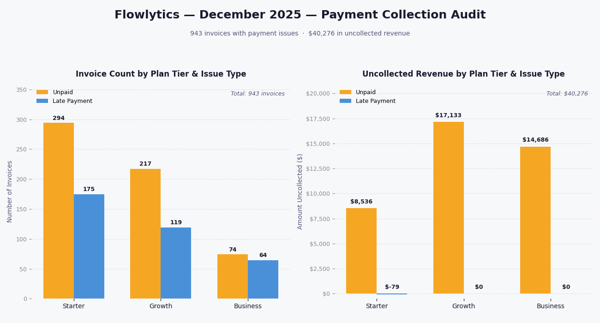

# SaaS Flowlytics - Subscription Revenue - Product Analytics - Revenue Reconciliation Analytics
MRR Movement, Net Revenue Retention, Geographic Revenue Distribution, Onboarding Experiment Analysis, and Revenue & Billing Reconciliation

 

End-to-end SaaS revenue analytics project analyzing synthetic subscription data from a workflow automation platform. The analysis covers MRR movement, Net Revenue Retention, geographic revenue distribution, onboarding experiment outcomes, and reconciliation between subscription and billing records using SQL and Python.

  

➤ Executive Summary : 
**What the project was trying to find out**

- Is Flowlytics growing its recurring revenue in a healthy, sustainable way?
- Does the new onboarding experience actually increase trial-to-paid conversion?
- Is the billing system accurately capturing all expected revenue?

**What the data showed**

- Revenue grew every month in 2025, but entirely from new customer acquisition — existing customers are not expanding
- Churn runs $7K–$14K every month, forcing the business to constantly replace lost revenue with new signups
- The new onboarding experience converted at 26.1% vs. 19.5% — a real, statistically confirmed improvement
- The billing system has three problems: missed invoices, invoices sent to cancelled accounts, and $40K in unpaid bills sitting uncollected

**What the key numbers are**

- $97,490 cumulative net MRR as of December 2025
- 6.54 percentage point conversion lift from the new onboarding (33.5% relative improvement)
- $1,145 in unbilled MRR, $2,457 overbilled, $40,355 uncollected

**What actions should follow**

- Roll out the new onboarding to all trial users immediately
- Investigate churn — reducing it has the same MRR impact as acquiring new customers
- Fix the Starter billing trigger before the problem compounds next month
- Fix the churn-to-billing handoff so cancellations stop generating invoices
- Contact Growth and Business accounts with unpaid December invoices directly

  
  
➤ Project Scope: 

This project evaluates how a simulated SaaS subscription business generates and retains recurring revenue over time—examining whether subscription growth is stable, whether product onboarding improvements meaningfully increase activation, and whether billing operations accurately capture all expected revenue.

The analysis measures monthly recurring revenue (MRR) movement by identifying new subscriptions, expansion upgrades, contraction downgrades, and churn events. It evaluates Net Revenue Retention (NRR) trends to determine whether existing customers expand their subscription value over time or whether revenue growth relies primarily on new customer acquisition.

At the product level, the project evaluates a controlled onboarding experiment to determine whether a redesigned onboarding experience increases trial-to-paid conversion. The analysis compares conversion rates between control and treatment groups, tests statistical significance, and analyzes user engagement characteristics associated with successful activation.

At the financial operations level, the project performs revenue reconciliation between subscription records and billing invoices to identify operational discrepancies such as missing invoices, billing errors, or delayed billing events. The objective is to evaluate whether subscription activity and billing operations remain aligned, ensuring that expected recurring revenue is properly captured.

  

➤ Core Business Questions : 

**1. REVENUE & SUBSCRIPTION ECONOMICS**
   
  1. How does Monthly Recurring Revenue (MRR) change each month when broken into new, expansion, contraction, and churned MRR?
  2. How does Net Revenue Retention (NRR) change over time?
  3. How are customers and subscription revenue distributed across U.S. states?
   
**2. PRODUCT EXPERIMENTATION**
   
  1. Does the new onboarding experience increase trial-to-paid conversion?
  2. Is the difference in trial-to-paid conversion between the control and treatment groups statistically significant?
  3. What user characteristics are associated with trial-to-paid conversion?

**3. FINANCIAL DATA VALIDATION — DECEMBER 2025 BILLING AUDIT**

  1. Which active subscriptions did not generate a billing invoice in December 2025, and how much recurring revenue was not billed?
  2. Which December 2025 billing invoices were generated for subscriptions that were not active that month, and how much was overbilled?
  3. Which December 2025 billing invoices have not been fully paid or were paid outside the expected payment window, and how much billed revenue remains uncollected?

  

➤ The Dataset : 
The raw dataset spans January 2024 through June 2026, and all reporting and conclusions in this project are intentionally scoped to this full analytical window to evaluate subscription revenue growth, customer activation behavior, product experimentation outcomes, and financial reconciliation across the subscription lifecycle.

 

---

 >

## The Main Report - Key Questions Answered

### 1 — REVENUE & SUBSCRIPTION ECONOMICS
Are our existing customers bringing in more revenue over time, or do we need a constant flow of new customers just to keep the numbers up?

 

**1-1  How does Monthly Recurring Revenue (MRR) change each month when broken into new, expansion, contraction, and churned MRR?**

**Charts**

  

 

**Key Insights**

- **MRR grew every single month in 2025 without exception.** The business ended the year at $97,490 in cumulative net MRR, adding positive net MRR all 12 months.
- **New customer acquisition is the sole growth engine.** New MRR runs at $16,000–$21,000 every month and completely dominates the chart. Expansion from existing customers is minimal — barely visible against the green bars.
- **Q1 was the most volatile quarter.** March shows the deepest churn of the year at over -$14,000, which nearly wiped out all new MRR that month — net MRR of only $2,994. This directly explains the NRR dip to 94.55% in March.
- **Churn is the biggest threat to the business.** Running at -$7,000 to -$14,000 every month, churn consistently offsets a large portion of new revenue. The business is essentially running on a treadmill — acquiring new customers to replace the ones leaving.
- **Expansion is too small to matter.** Expansion MRR never exceeds $2,000 in any single month. This means the business has not found a way to grow revenue from customers already on the platform — upselling and cross-selling are not working.

 

---

 

**1-2  How does Net Revenue Retention (NRR) change over time?**

 

**Charts**

  

**Key Insights**

- **Flowlytics grew every month in 2025, but entirely from new customers signing up.** Existing customers were not spending more over time — upgrades and expansions were minimal all year.
- **Existing customers were leaving or downgrading every single month.** The business lost between 2.6% and 5.5% of its existing revenue each month to cancellations and downgrades. New signups covered the losses, but just barely.
- **March was the worst month.** Churn spiked, new revenue barely covered the losses, and the business nearly flatlined. After March things improved, but the underlying problem never went away.
- **The business is entirely dependent on new customer acquisition.** Every month, Flowlytics has to sign up enough new customers just to replace the ones it lost. If new signups slow down for even one or two months, revenue will drop. That is a fragile position to be in.
- **The opportunity is in existing customers.** If Flowlytics could get them to upgrade their plans or use more features, revenue would grow even without a single new signup. Right now that is not happening.

 

---

 

**1-3  How are customers and subscription revenue distributed across U.S. states?**

 

**Charts**

  

**Key Insights**
- **Revenue is heavily concentrated in three states**. CA, NY, and TX are the clear leaders — visually the darkest on the map and the longest bars on the chart. There is a noticeable gap between TX and FL, marking a sharp drop-off after the top three.
- **The top 5 states follow U.S. tech and population centers**.CA, NY, TX, FL, and WA dominate the bar chart. This is expected for a workflow automation product — these states have the highest density of tech companies and knowledge workers.
- **The revenue base is top-heavy.** After the top 5 states the bars shrink rapidly and consistently. The majority of states show minimal bar length, indicating that most of the U.S. geography contributes very little to total MRR.

 

**1-4  Business Recommendation**
- **Flowlytics has a stable and growing revenue base, but the growth model is fragile.** The business is entirely dependent on new customer acquisition to offset churn. If new signups slow down for even one or two months, total MRR will decline. This is not a sustainable position for a mature SaaS company.
- There are two levers available to fix this.
  - **The first is reducing churn.** Churn runs at $7,000 to $14,000 every month — that is revenue the business has already earned and is losing. Identifying why customers cancel and addressing those reasons directly will have immediate impact on net MRR without requiring a single new signup.
  - **The second is expanding revenue from existing customers**. Expansion MRR never exceeds $2,000 in any month — meaning upselling and plan upgrades are effectively not happening. A mature SaaS business should be growing revenue from its existing base through plan upgrades, seat expansion, or add-on features. Flowlytics is not doing this. Fixing this would allow the business to grow even in months where new customer acquisition is slow.
- **Geographic concentration is a secondary risk.** CA, NY, and TX together represent a disproportionate share of total MRR. A significant economic disruption or competitive entry in any of these three states would have outsized impact on the business.

 

---

 

### 2 — PRODUCT EXPERIMENTATION

**2-1  Does the new onboarding experience increase trial-to-paid conversion?**

 

**Charts**

  

**Key Insights :**

- The treatment group converted at 26.06%, compared to 19.52% for the control group — a difference of 6.54 percentage points.
- The new onboarding experience produced a 33.5% relative improvement in trial-to-paid conversion over the old experience.
- The treatment group had fewer trial users (13,993) than the control group (21,007) — a 60/40 split rather than the expected 50/50. This unequal distribution is worth investigating as it may indicate an issue with the experiment assignment process.
- The data directionally supports that the new onboarding experience is more effective at converting trial users to paid subscribers. However, statistical significance has not yet been tested — that is business question 2-2.

 

---

 

**2-2  Is the difference in trial-to-paid conversion between the control and treatment groups statistically significant?**

 

**Charts**

  

**Key Insights :**
- The chi-square statistic is 207.65, which is very large. This means the observed conversion counts are far from what would be expected if the new onboarding had no effect.
- The p-value is 0.000000 — effectively zero. This means the probability of seeing a difference this large by random chance alone is virtually zero.
- The result is statistically significant at the 0.05 significance level. The 6.54 percentage point improvement in conversion rate from the new onboarding experience is a real effect, not random noise.
- Combined with the findings from 2-1, the evidence is clear: the new onboarding experience meaningfully increases trial-to-paid conversion and the result is statistically confirmed.

 

---

 

**2-3  What user characteristics are associated with trial-to-paid conversion?**

  

**Key Insights**
Based on the two charts:

- Conversion only happens at the top engagement tier/ at Quartile 4. This means low-to-mid engagement during trial is not a reliable signal — users need to be in the top 25% of engagement before conversion becomes likely.
- "Templates used" and "workflows" created are the strongest differentiators. Both show separation ratios above 3x. Converted users used 3x more templates and created 3x more workflows than non-converters. These two features best separate the two groups.
- Days active has the sharpest Q4 jump. At Q4, days active reaches 68% conversion rate — the highest of all four features. Users who consistently return during the trial are the most likely to pay. Stickiness is the strongest conversion signal.
- Integrations connected is the most linear predictor. Unlike the other three features which are flat until Q4, integrations connected shows a steadier climb from Q1 to Q4. Every additional integration meaningfully increases conversion probability even at lower engagement levels. This makes it the most actionable early signal — a user who connects even one integration is already more likely to convert than someone who uses templates or creates workflows at the same engagement tier.

 

**2-4 Business Recommendation :**
- **Roll out the new onboarding experience to all trial users.** The treatment group converted at 26% vs 19.5% for control — a 6.54 percentage point improvement that is statistically confirmed. There is no reason to keep the old experience running.
- **Build onboarding flows that push users toward templates and workflows early.** Templates used and workflows created are the strongest predictors of conversion at 3.13x and 3.08x separation. The onboarding experience should guide every new trial user to use at least one template and create at least one workflow within the first few days.
- **Use integration connection as the early warning signal.** Integrations connected is the most linear predictor — even one integration meaningfully increases conversion probability. Flag trial users who have not connected any integration by day 3 and trigger a re-engagement nudge.
- **Focus re-engagement efforts on users who are not returning.** Days active at Q4 has the highest conversion rate at 68%. Users who stop logging in after day 1 or 2 are very unlikely to convert. An automated email or in-app prompt targeting inactive trial users could recover a meaningful portion of that group.

 

---

 

### 3 — FINANCIAL DATA VALIDATION — DECEMBER 2025 BILLING AUDIT

**3-1 Which active subscriptions did not generate a billing invoice in December 2025, and how much recurring revenue was not billed?**

**Tables used :**
- subscriptions
- billing_invoices
- customers

**SQL Method - Which Active Subscriptions Are Not Billed ?**
- **Filter subscriptions to those active during December 2025:** Filter the subscriptions table to keep only rows where **subscription_status** = '**active**' and **subscription_start** <= '2025-12-31'. Retain **subscription_id**, **customer_id**, and **plan_tier**.
- **Identify subscriptions that churned before December 2025:** Filter the subscription_events table to keep only rows where **event_type** = '**churn**' and **event_date** < '2025-12-01'. Retain **subscription_id** only as a disqualification list.
- **Remove pre-December churned subscriptions:** Left join the filtered subscriptions against the churn disqualification list on **subscription_id**. Retain only rows where no matching churn record exists. Retain **subscription_id**, **customer_id**, and **plan_tier**.
- **Filter billing invoices to December 2025:** Filter the **billing_invoices** table to keep only rows where **invoice_month** >= '2025-12-01' and **invoice_month** < '2026-01-01'. Retain **subscription_id** only.
- **Identify active subscriptions with no December 2025 invoice:** Left join the churn-excluded subscriptions against the filtered December invoices on **subscription_id**. Retain only rows where no matching invoice exists. Retain **subscription_id**, **customer_id**, and **plan_tier**.
- **Assign expected invoice amount per subscription:** Derive a new column called **expected_amount** using **plan_tier** as the business rule — Starter = 29, Growth = 79, Business = 199. Order by **plan_tier** and **subscription_id**.

The answer of this business question is here :
[03_1a_Which_Active_Subs_Not_Billed.csv](https://raw.githubusercontent.com/felixsuwarno/SaaS_Flowlytics-Subscription_Revenue-Product_Analytics-Revenue_Reconciliation_Analytics/refs/heads/main/Data_Generated/03_1a_Which_Active_Subs_Not_Billed.csv)
-> this contains 70 subscriptions_id which are not billed properly in December 2025.

**SQL Method - How Much was the Missing Bill**
- **Load the billing gap records:** Read from **03_1a_Which_Active_Subs_Not_Billed** which contains all active subscriptions with no December 2025 invoice and their expected_amount. Retain **plan_tier** and **expected_amount**.
- **Aggregate revenue leakage by plan tier:** Group by **plan_tier** and calculate two metrics:
  - **subscription_count:** the number of active subscriptions with no December 2025 invoice in that tier
  - **revenue_not_billed:** the sum of expected_amount across all gap subscriptions in that tier

**Python Method**
Python is used to visualize the data, there is no data modeling steps needed.

  

**Key Insights**
- **Billing gap is narrow.** 25 subscriptions missed — not systemic, but $1,145 in MRR that existed and wasn't captured.
- **Starter is a volume problem, not a revenue problem.** 76% of missed subscriptions, only 48% of missed revenue. Low unit value ($29), high count — points to a billing trigger issue at that tier.
- **Growth is the priority.** 5 subscriptions, $395 — best combination of recoverability and dollar impact.

 

---

 

**3-2 Which December 2025 billing invoices were generated for subscriptions that were not active that month, and how much was overbilled?**

**Tables used :**
- subscriptions
- billing_invoices
- subscription_events

**SQL Method - Which inactive subscriptions are billed?**
- **Filter billing invoices to December 2025:** Filter the **billing_invoices** table to keep only rows where **invoice_month** falls within December 2025. Retain **invoice_id**, **subscription_id**, **customer_id**, **invoice_month**, and **invoice_amount**.
- **Filter subscription events to churn events only:** Filter the subscription_events table to keep only rows where **event_type** = 'churn'. Retain **subscription_id** and event_date.
- **Join subscriptions to churn events:** Left join the subscriptions table against the churn-filtered subscription events on **subscription_id**. Retain **subscription_id**, **customer_id**, **subscription_start**, **subscription_status**, and event_date.
- **Derive first churn date per subscription:** Group the joined records by **subscription_id**, **customer_id**, **subscription_start**, and **subscription_status**. Derive a new column called **first_churn_date** as the earliest event_date per subscription.
- **Derive December 2025 activity flag per subscription:** From the aggregated records, derive a new column called **active_in_dec_2025** using three disqualification rules:
  - Set to 0 if **subscription_start** > '2025-12-31' — subscription did not yet exist in December 2025
  - Set to 0 if **first_churn_date** < '2025-12-01' — subscription was already churned before December
  - Set to 0 if **subscription_status** = 'cancelled' — subscription is marked inactive regardless of churn event presence
  - Otherwise set to 1
- **Identify December invoices issued to inactive subscriptions:** Left join the filtered December invoices against the activity flag on **subscription_id**. Retain only rows where **active_in_dec_2025** = 0, defaulting to 0 via COALESCE where no activity flag record exists. Retain **invoice_id**, **subscription_id**, **customer_id**, **invoice_month**, **invoice_amount**, **first_churn_date**, and **active_in_dec_2025**.

**SQL Method - How Much was the Overbill ?**

- **Aggregate overbilled invoices to calculate total overbilled amount:** Summarize the total billed revenue from subscriptions that were not active in December 2025.
  - Use the table **03_2a_Which_Inactive_Subs_Are_Billed**
  - Create **overbilled_amount** as the sum of invoice_amount
- Return final overbilling result: Output the total overbilled amount for December 2025.
  - Select the aggregated result for reporting

**Python Method**
Python is used to visualize the data, there is no data modeling steps needed.

  

**Key Insights**
Based on the two charts:
- **Starter dominates by count, contributes least by dollar.** 15 subscriptions (45%) but only $435 (18%). Same pattern as the billing gap — high volume, low unit value.
- **Growth and Business are the priority.** Growth: 13 subscriptions, $1,027 (42%). Business: 5 subscriptions, $995 (40%). Together they represent 82% of overbilled revenue from just 55% of affected subscriptions.

 

---

 

**3-3 Which December 2025 billing invoices have not been fully paid or were paid outside the expected payment window, and how much billed revenue remains uncollected?**

**Tables used :**
- subscriptions
- billing_invoices
- payments

**SQL Method - Which December 2025 billing invoices have not been paid or were paid outside the expected payment window (30 days )?**

- **Filter billing invoices to December 2025:** Filter the **billing_invoices** table to keep only rows where **invoice_month** = '2025-12-01'. Retain **invoice_id**, **subscription_id**, **customer_id**, **invoice_month**, and **invoice_amount**.
- **Filter payments to December 2025 and later:** Filter the payments table to keep only rows where **payment_date** >= '2025-12-01'. Retain **invoice_id**, **payment_amount**, and **days_to_pay**.
- **Aggregate payment totals per invoice:** Group the filtered payments by **invoice_id**. Derive **total_paid** as the sum of **payment_amount** and **max_days_to_pay** as the maximum **days_to_pay**.
- **Join December invoices to aggregated payments:** Left join the filtered invoices against the aggregated payment metrics on **invoice_id**. Apply COALESCE to **total_paid** to default to 0 where no payment record exists. Retain **invoice_id**, **subscription_id**, **customer_id**, **invoice_month**, **invoice_amount**, **total_paid**, and **max_days_to_pay**.
- **Join to subscriptions to bring in plan tier:** Left join the invoice-payment records against the subscriptions table on subscription_id. Retain all prior columns plus plan_tier.
- **Classify payment issue type per invoice:** From the plan-tier-joined records, derive two new columns.
  - Derive payment_issue_type using three rules:
    - Set to '**Unpaid**' if **total_paid** = 0
    - Set to '**Partially** Paid' if **total_paid** > 0 and **total_paid** < invoice_amount
    - Set to **'Late Payment**' if **total_paid** >= **invoice_amount** and **max_days_to_pay** > 30
  - Derive amount_outstanding as invoice_amount - total_paid
- **Retain only invoices with a payment issue:** Filter to keep only rows where **payment_issue_type** is not null.

**SQL Method - How much billed revenue remains uncollected ??**
- **Load payment issue records:** Read from **03_3a_Which_Bills_Are_Unpaid**. Retain **payment_issue_type**, **plan_tier**, **invoice_amount**, and **amount_outstanding**.
- **Aggregate metrics by issue type and plan tier:** Group by **payment_issue_type** and **plan_tier**. Derive three metrics:
  - **invoice_count** — number of invoices with a payment issue in that group
  - **total_billed** — sum of **invoice_amount** across all invoices in that group
  - **total_uncollected** — sum of **amount_outstanding** across all invoices in that group
 
**Python Method**
Python is used to visualize the data, there is no data modeling steps needed.

  

**Key Insights**
- **Unpaid is the real problem.** 585 invoices completely uncollected — $40,355 in revenue that was billed and never paid. Late Payment invoices are eventually collected, so they carry no outstanding balance.
- **Growth leads unpaid by dollar value.** 217 unpaid Growth invoices at $79 each = $17,133. The highest single segment. Business is second at $14,686 despite fewer invoices — purely because of the $199 unit price.
- **The -$79 on Starter Late Payment is a legitimate anomaly.** One customer overpaid against a Starter invoice. Worth flagging for a billing adjustment.

**3-4 - Business Recommendation**
- **Fix the billing trigger for Starter accounts.** The volume of missed invoices at the Starter tier is too consistent to be random. Something in the billing pipeline is systematically skipping these accounts. Find it and fix it before it compounds next month.
- **Fix the churn-to-billing handoff.** Cancellations are not reaching the billing system before invoices go out. Put a process in place so that when a customer cancels, the billing system is updated before the next invoice run — not after.
- **Follow up on unpaid invoices now.** $40,355 is sitting uncollected. Growth and Business accounts make up the majority of that amount. Contact them directly. The longer these sit, the harder they are to recover.
